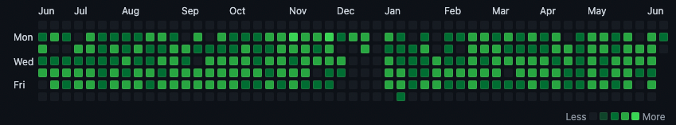

# github-cheater

 
 
 
 
 

 
 
 
 
 

# What is this?
This is just a small Python script that you can either run manually or in a pipeline that will git clone a private repository
of your choosing, create a file inside it and then push it back to your private repository.

# Why do this?
If you can to get more green squares in your Github profile

# What is the point?
None, please create a PR if you come up with any

# Quick start guide

1. Get GitPython by running `pip3 install GitPython`
2. Create a Github token from: https://docs.github.com/en/authentication/keeping-your-account-and-data-secure/creating-a-personal-access-token
3. Change `pat` and `git_username` variables
4. Execute by running `python greenmode.py`

# What is the future of this?
I have big plans for this, the future features are as follows:

1. Add Lorem Ipsum to randomise comments
2. Add ability to randomise commit amounts
3. Change to suit running in a Lambda function

_Feel free to create a PR for any of the above_